# Casos de prueba — Voz del Ciudadano

Casos que verifican los requisitos a traves de los patrones implementados. La evidencia es doble:

1. **Demos por patron** (`main.ts`): muestran cada patron funcionando con su mensaje de salida.
2. **Tests por caso** (`vitest -t`): verifican entrada/esperado de cada CP de forma aislada.

> Como reproducir: desde `implementacion/`, correr `npm install` una vez. Luego cada demo con `npm run demo:<patron>` y cada test con su comando `vitest`. La bandera `-t` filtra solo el test del caso; `--reporter=verbose` muestra el nombre del test en verde.

---

## Parte 1 — Demos: los patrones funcionan

Cada demo imprime un mensaje que evidencia el patron en uso (no un cascaron vacio).

### Composite — `npm run demo:composite`

Arma una propuesta jerarquica (capitulos/articulos/incisos) y cuenta todo el arbol.

```bash
npm run demo:composite
```

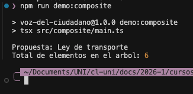

### Adapter — `npm run demo:adapter`

Valida firmas contra el servicio externo a traves de la interfaz `ValidadorFirma`.

```bash
npm run demo:adapter
```

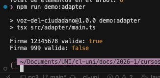

### Flyweight — `npm run demo:flyweight`

Dos firmas del mismo tipo comparten la misma instancia intrinseca.

```bash
npm run demo:flyweight
```

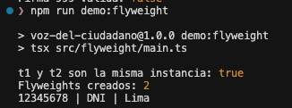

### Proxy — `npm run demo:proxy`

Al cruzar 25000 firmas, el proxy sella (guarda el hash) y bloquea escrituras posteriores.

```bash
npm run demo:proxy
```

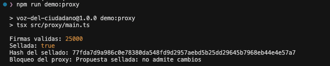

### Facade — `npm run demo:facade`

`enviarAlCongreso` coordina los subsistemas: empaquetar y notificar comisiones.

```bash
npm run demo:facade
```

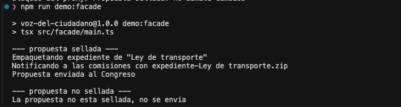

---

## Parte 2 — Tests: cada caso de prueba verificado

## CP-01 — Contar elementos de la propuesta

Verifica RF1 mediante el Composite.

Entrada: una propuesta con un capitulo que contiene dos articulos y un inciso.
Esperado: el conteo total de elementos coincide con la suma de capitulo, articulos e inciso.

```bash
npx vitest run -t "cuenta todo el arbol" --reporter=verbose
```

Evidencia:

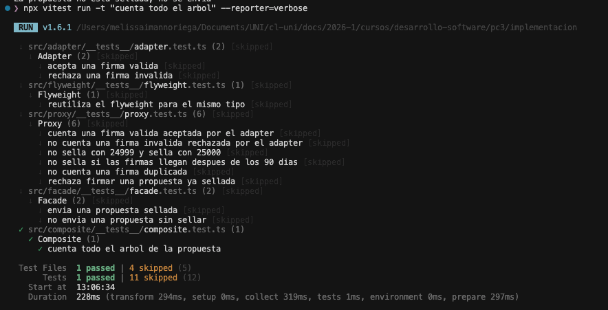

## CP-02 — Firma valida se cuenta

Verifica RF3, RF4 y RF6 mediante el Adapter.

Entrada: una firma con documento valido segun el servicio externo.
Esperado: la firma se acepta y el conteo de firmas validas sube en uno.

```bash
npx vitest run -t "cuenta una firma valida aceptada por el adapter" --reporter=verbose
```

Evidencia:

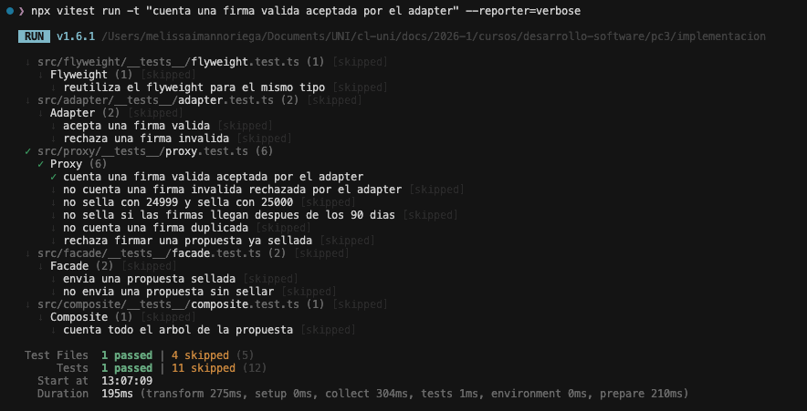

## CP-03 — Firma invalida no se cuenta

Verifica RF4 mediante el Adapter.

Entrada: una firma con documento que el servicio externo marca como invalido.
Esperado: la firma se rechaza y el conteo no cambia.

```bash
npx vitest run -t "no cuenta una firma invalida" --reporter=verbose
```

Evidencia:

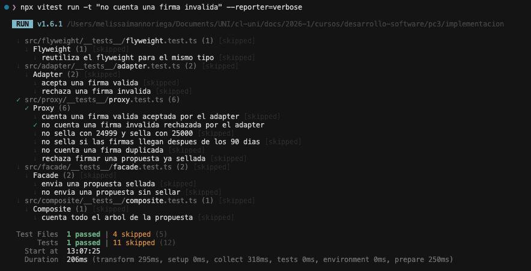

## CP-04 — Firma duplicada no se cuenta

Verifica RF5.

Entrada: dos firmas del mismo ciudadano sobre la misma propuesta.
Esperado: solo se cuenta una.

```bash
npx vitest run -t "no cuenta una firma duplicada" --reporter=verbose
```

Evidencia:

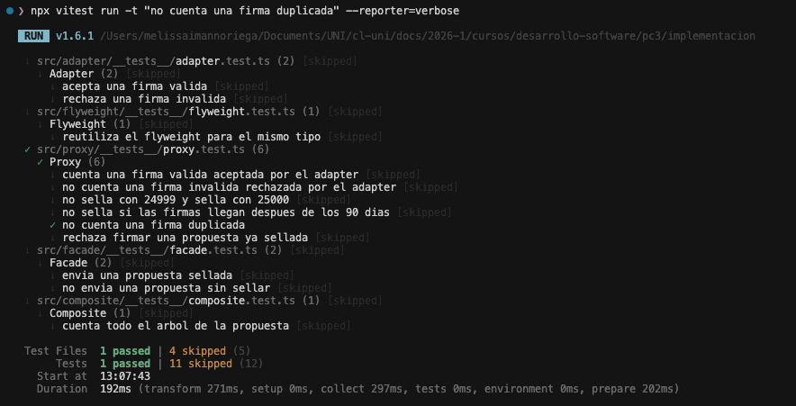

## CP-05 — Firmas del mismo tipo comparten datos

Verifica RNF1 mediante el Flyweight.

Entrada: dos firmas que comparten el mismo tipo de documento y distrito.
Esperado: ambas reutilizan la misma instancia de tipo de firma.

```bash
npx vitest run -t "reutiliza el flyweight" --reporter=verbose
```

Evidencia:

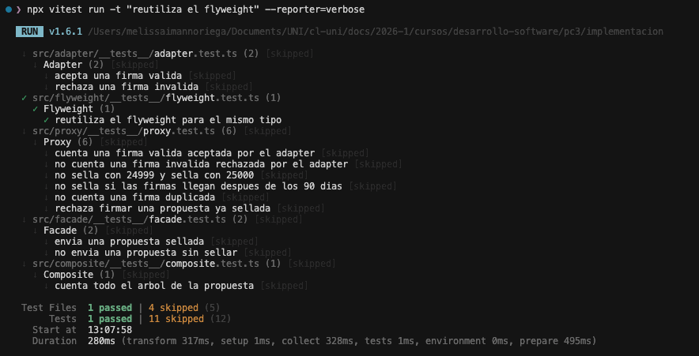

## CP-06 — Umbral exacto de sellado

Verifica RF8.

Entrada: una propuesta con 24999 firmas validas y luego con 25000.
Esperado: con 24999 no se sella; con 25000 se sella.

```bash
npx vitest run -t "no sella con 24999" --reporter=verbose
```

Evidencia:

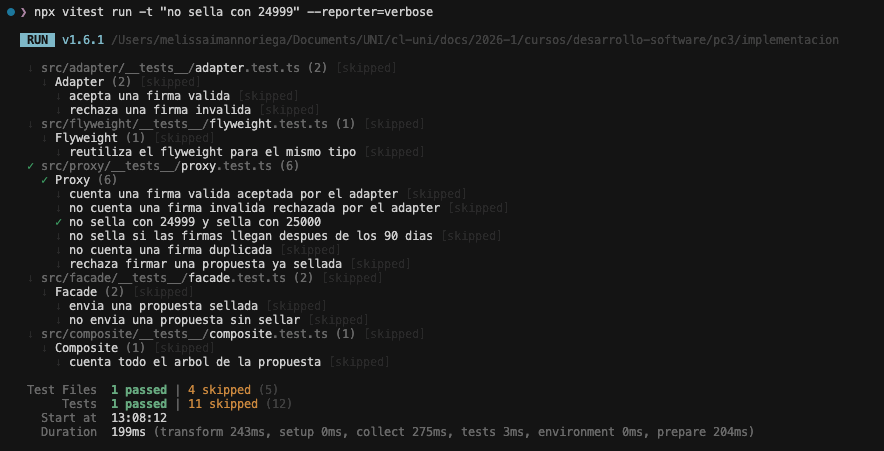

## CP-07 — Plazo vencido

Verifica RF7.

Entrada: una propuesta que llega a 25000 firmas despues de los 90 dias.
Esperado: la propuesta no se sella y queda rechazada por plazo.

```bash
npx vitest run -t "no sella si las firmas llegan despues" --reporter=verbose
```

Evidencia:

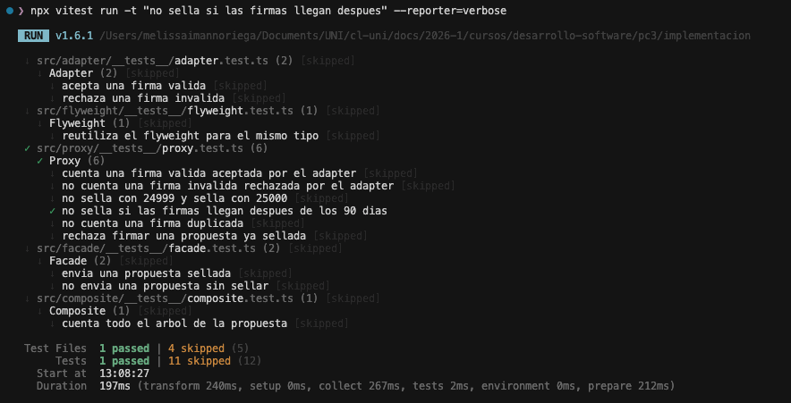

## CP-08 — Propuesta sellada bloquea cambios

Verifica RF9 mediante el Proxy.

Entrada: una propuesta ya sellada a la que se intenta agregar una firma o un cambio.
Esperado: la operacion se rechaza con error.

```bash
npx vitest run -t "rechaza firmar una propuesta ya sellada" --reporter=verbose
```

Evidencia:

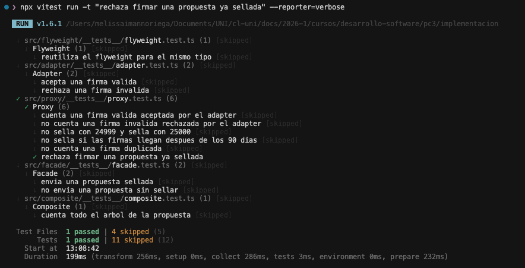

## CP-09 — Envio al Congreso

Verifica RF10 mediante el Facade.

Entrada: una propuesta que alcanza el limite dentro del plazo.
Esperado: el envio ejecuta validar, sellar, empaquetar y notificar, y deja la propuesta enviada.

```bash
npx vitest run -t "envia una propuesta sellada" --reporter=verbose
```

Evidencia:

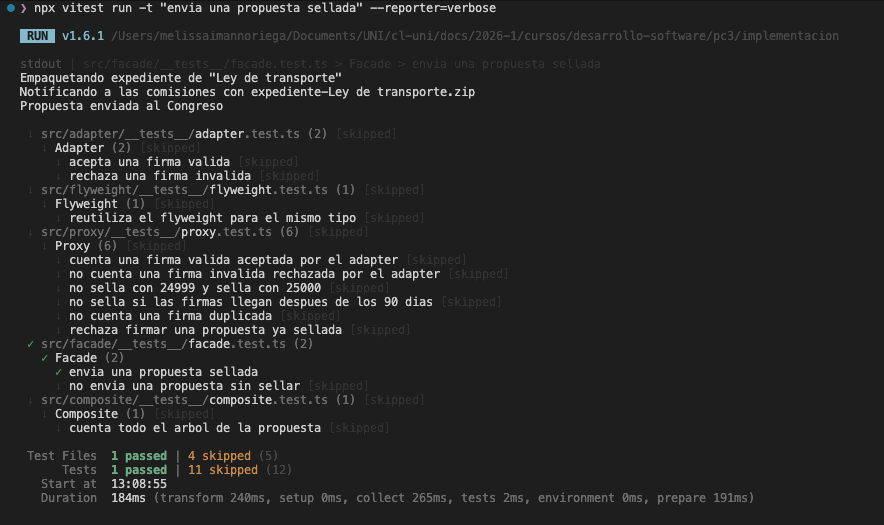

---

## Corrida completa de la suite

Evidencia global: los 12 tests (9 casos + 2 del Adapter directo + 1 facade negativo) pasan.

```bash
npx vitest run --reporter=verbose
```

Evidencia:

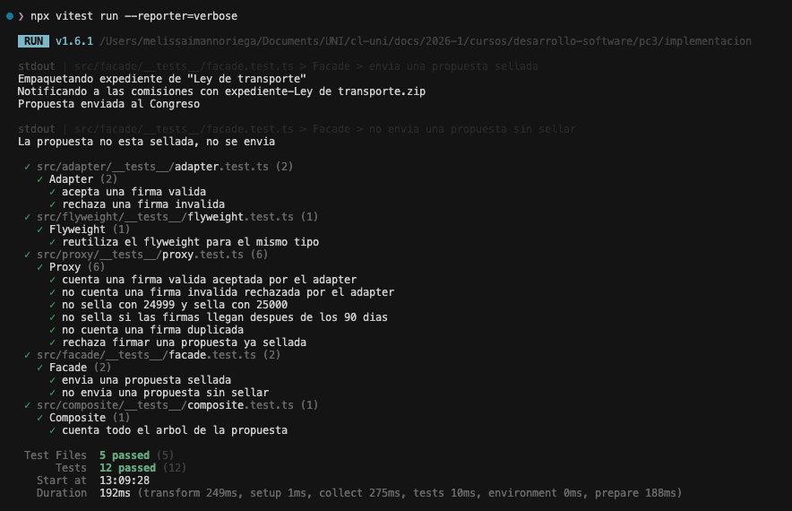
